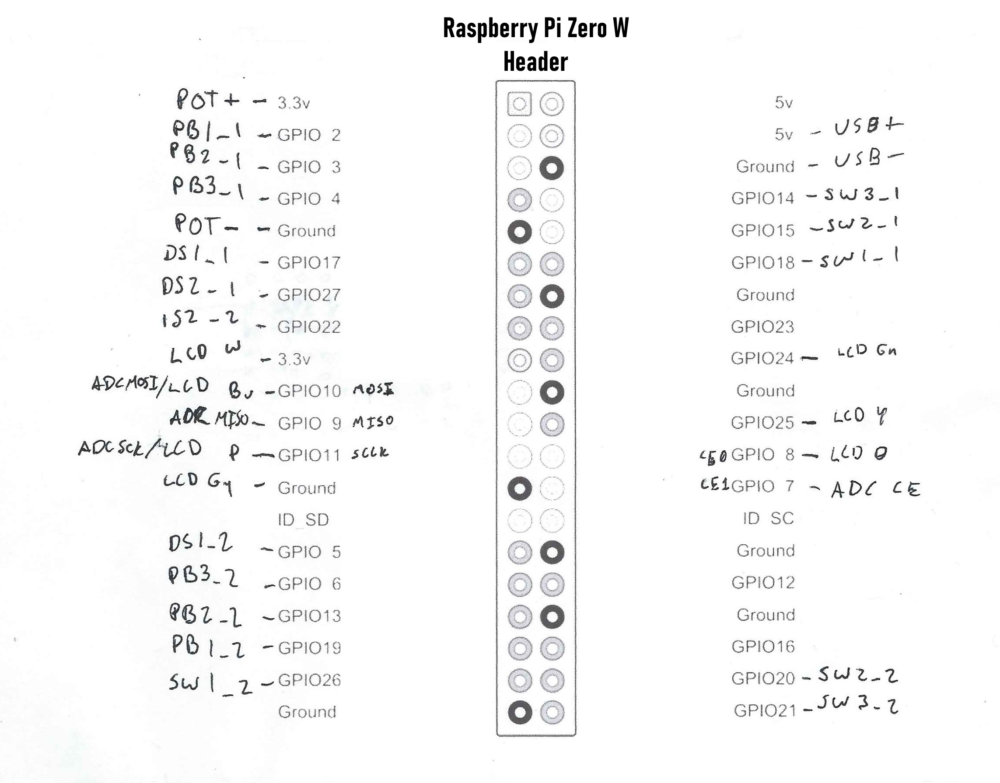
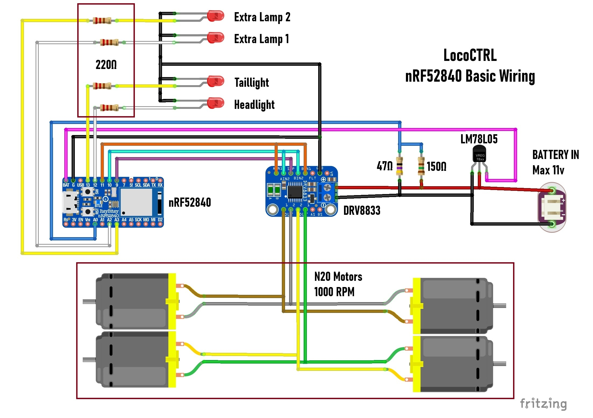

# lococtrl

**LocoCTRL** is a two-part system for controlling model locomotives using a Raspberry Pi-based remote control and a CircuitPython-powered microcontroller inside the locomotive.

- **Controller**: A set of Python programs and a systemd service that runs on a Raspberry Pi built into a physical remote control.
- **Locomotive**: A CircuitPython program that runs on a microcontroller inside a model locomotive.

## **Table of Contents**

- [Hardware Requirements](#hardware-requirements)
- [Wiring Guide](#wiring-guide)
- [Installation](#installation)
  - [Controller Setup](#controller-setup)
  - [Locomotive Setup](#locomotive-setup)
- [Usage](#usage)
- [Contributing](#contributing)
- [License](#license)

---

## **Hardware Requirements**

### **Controller (Raspberry Pi)**

- (1) [3D printed enclosure and components](https://www.printables.com/@nullroute)
- (1) Raspberry Pi Zero W
- (1) ST7735 1.8 Inch LCD Module, mine was "KEYES" branded but there's many available
- (2) B10k potentiometer
- (1) MCP3008 Analog to Digital convertor IC
- (7) SPDT Toggle Switch model 54-302E or similar
- (2) SPDT Center Off model E-TEN1122 or similar
- (6) 6x6 tactile switches, 9mm operator
- (1) 150 ohm resistor
- (1) 47 ohm resistor
- (1) LM1084 5v voltage regulator, or similar. Must be able to power RPi (~2A probably)
- (24) M2.3x8 self tapping screws, or similar
- AA size battery springs, enough for 8 batteries in series
- (8) AA batteries, I use rechargable NiMH

### **Locomotive (Microcontroller)**

- (1) nRF52840 breakout board, any board with CircuitPython support and BLE should work with slight changes
- (1) DRV8833 motor driver
- (2-4) LEDS for head/tail lights
- (2-4) 220 ohm resistors
- (1) 150 ohm resistor
- (1) 47 ohm resistor
- (1) L78L05 5v voltage regulator
- (2-4) N20 1000RPM motors
- (1) Battery pack, I use 8.4v NiMH packs.

---

## **Wiring Guide**

### **Controller Wiring**


(To be updated)

### **Locomotive Wiring**



---

## **Installation**

### **Controller Setup**

1. For best results, start with a fresh Raspibian image and use the default 'pi' user

2. SSH into the Pi

3. Clone the repository:

   ```sh
   cd /home/pi
   git clone https://github.com/nullrails/lococtrl.git
   ```

4. Install required Python dependencies:

   ```sh
   pip install Adafruit_MCP3008
   ```

5. Move systemd service file into place:

   ```sh
   sudo cp lococtrl/docs/lococtrl.service /etc/systemd/system/
   sudo systemctl enable lococtrl
   sudo systemctl start lococtrl
   ```
   
6. System should now be functioning, and will start automatically on boot

---

### **Locomotive Setup (CircuitPython)**

1. Install **CircuitPython** on your microcontroller. See [CircuitPython Downloads](https://circuitpython.org/downloads).

2. Connect your microcontroller via USB and copy the required files:
   - Drag and drop all of the files from `lococtrl/locomotive/` into the `CIRCUITPY` drive.
   
3. Edit `lococtrl_settings.py` to set up motor drivers and communication:
   - Edit the file to match your setup. If you follow the wiring diagram exactly the only thing you should change is the locomotive name.
   - If forward isn't forward, you can swap the 'forward' and 'reverse' pin definitions in this file.
   
4. The program should start automatically when the board is powered. The locomotive will enter pairing mode automatically after power up, and after the controller is unpaired. The head and tail lights will fade on and off when unpaired.

---

## **Usage**

When pairing, the controller will connect to the first locomotive it finds. Two locomotives can be paired simultaneously.

---

## **Contributing**

If you'd like to contribute, feel free to submit issues or pull requests!

---

## **License**

This project is licensed under the MIT License. See `LICENSE` for details.

